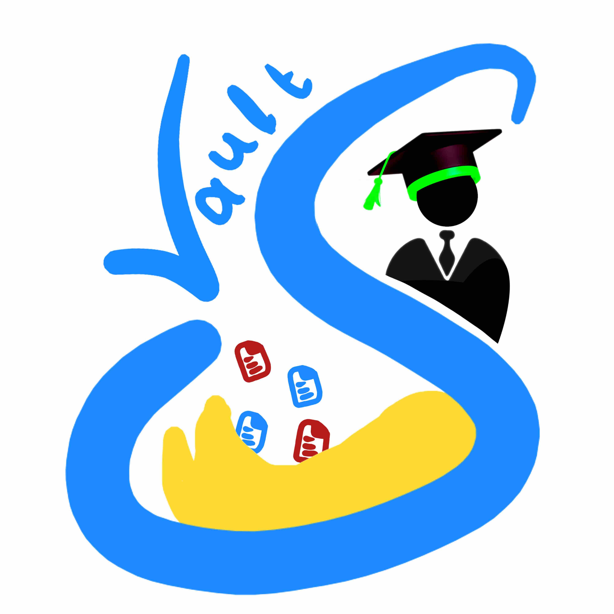

<div align="center">
  <!-- TODO: Drag and drop your logo file here! Or update the image path below once added -->
  
  
  <h1>ScholarVault</h1>
  <p><strong>Your Ultimate All-in-One Academic & Productivity Workspace</strong></p>
  
  <p>
    <a href="https://github.com/YOUR_USERNAME/YOUR_REPO_NAME/releases">Releases</a> • 
    <a href="#features">Features</a> • 
    <a href="#contributing">Report a Bug / Request Feature</a>
  </p>
</div>

---

## 📖 About ScholarVault

ScholarVault is a fully self-contained offline-first application meticulously designed for students, researchers, and professionals who want maximum productivity without compromising their privacy. 

It completely removes the need to juggle 10 different apps (scanners, flashcards, calculators, generic note-taking tools, budget trackers) by bringing all essential academic utilities together into one beautiful, Material Design 3 workspace. 

Everything you do happens right on your device. Your data, your rules!

## ✨ Key Features

**📚 Academic Organization**
- **Course & Task Tracking:** Manage semesters, courses, and assignments effortlessly. Keep records of your grades and deadlines.
- **Smart Reminders:** Get reliable push notifications for assignment deadlines or upcoming exams.
- **Quick Notes & Flashcards:** Quickly jot down class notes or memorize topics with an integrated flashcard engine.

**📂 Document & PDF Hub**
- **Pro-level PDF Viewer:** View, annotate, search, and manage complex PDFs locally. 
- **PDF N-Up & Inverter:** Merge multiple pages into a single sheet, create custom printable bounds, and invert colors for night-time reading (Dark Mode PDFs).
- **Offline Camera Scanner:** Snap photos of whiteboard notes or assignments, filter them cleanly, and export as industry-standard PDFs.

**⚙️ Essential Micro-Tools**
- **Floating Calculator & Unit Converter:** Instantly do math or convert measurements without interrupting your reading flow. 
- **Media Suite:** Record audio notes during lectures, crop or resize images efficiently, and securely backup local data.
- **Image Resizer / Compressor:** Shrink assignments down to fit portal upload limits easily!
- **Focus Timer:** Built-in Pomodoro-style timer to lock in and maximize study sessions.

**💰 Wallet & Budget Tracker**
- **Secure Transaction Ledger:** Track academic expenses (books, tuition, supplies).
- **Pattern Lock Security:** Restrict your sensitive data behind an encrypted, biometric-ready pattern lock barrier. 

## ⬇️ Download & Installation

With our automated Continuous Integration (CI), you don't even need to build the app from source to test it out! 

1. Go to the **[Releases](../../releases)** tab on GitHub.
2. Download the `.apk` file from the latest release.
3. Install the APK on your Android device (you may need to enable *Install from Unknown Sources*).
4. No internet connection or account creation required. Just launch and study!

## 🚀 How to Build from Source

If you want to compile the project locally for development or verification:

1. Clone this repository:
   ```bash
   git clone https://github.com/YOUR_USERNAME/YOUR_REPO_NAME.git
   ```
2. Open the project in **Android Studio** (Electric Eel or newer).
3. Wait for Gradle to sync dependencies.
4. Click the **Run** button to compile and load the app onto an emulator or physical device.

---

## 🛠 Features & Issue Tracking

We love building new features and refining the experience, and your feedback makes ScholarVault better!

- **Found a bug?** Something crashing or acting weird? Please create a [New Bug Report](../../issues) in the Issues tab. Provide a brief explanation of what happened and (if possible) how to recreate it.
- **Have an idea?** Missing a calculator standard? Want a new layout? Open a [Feature Request](../../issues). We welcome all ideas to make student life simpler.

## 📄 License & Privacy

ScholarVault prioritizes privacy. 
* **Zero Cloud Lock-in:** We do not automatically send your notes or wallet logs to any cloud server. Everything is stored persistently in local SQLite databases utilizing Room architecture.
* **No Telemetry / Trackers:** Focus purely on your academics without underlying analytics tracking your every tap.

**License:** This project is licensed under the **GNU General Public License v3.0 (GPL-3.0)**. See the `LICENSE` file for more details.

---
*Created by Suvadip Patra - Dedicated to streamlining student experiences.*
